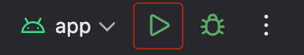

## 앱 실행 방법

- 안드로이드 스튜디오에서 [Run 'App'] 버튼을 눌러주세요
  

## 실행 모습

https://github.com/user-attachments/assets/19a13a4c-2095-45ae-9c62-c7ef7f5e8534

## 가정한 스펙

- MORE footer는 STYLE, GRID 타입에만 존재할 수 있다고 가정
- BANNER contents.type에는 Banner, 
  GRID, SCROLL contents.type에는 Goods, 
  STYLE contents.type에는 Style 아이템만 들어온다고 가정

## 추가 고려 사항

- 다크 모드 대응
- API 콜 응답 json 에 Contents.type 추가 or 변경되는 경우 대응 
- 헤더 링크, 컨텐츠 아이템 링크 클릭 대응
- 로딩, 실패 상태 및 UI 대응